# When Semantic Search Fails: The Vocabulary Mismatch Problem

> **Learning Objectives:**
>
> - Understand why semantic search fails for abstract queries on code
> - Learn how to diagnose vocabulary mismatch in your own systems
> - Apply query formulation best practices for code search
>
> **Prerequisites:**
>
> - [Vector Search Concepts](../concepts/vector-search-concepts.md)
> - Basic understanding of embeddings
>
> **Audience:** Search engineers, RAG developers, users of code search tools

---

## TL;DR

A user searched for "error handling retry backoff" (abstract concepts) but the code uses `Retry`, `RetryConfig`, and `DownloadWithRetry` (concrete identifiers). The semantic embeddings failed to bridge this vocabulary gap. The word "backoff" only appeared in comments, not as a code symbol. This root cause analysis led to two solutions: contextual retrieval (ADR-033) and query expansion (ADR-034).

---

## The Mystery

A user asked: "Where is the retry logic with exponential backoff?"

The search returned **no results**.

But the code definitely exists:

```
internal/errors/retry.go
internal/embed/retry.go
```

Both files implement exactly what the user asked for. So why did semantic search fail?

---

## Query Type Success Matrix

Different query patterns have dramatically different success rates:

```mermaid
%%{init: {'theme':'base', 'themeVariables': {'primaryColor':'#4dabf7','primaryTextColor':'#212529','primaryBorderColor':'#339af0','lineColor':'#495057','secondaryColor':'#51cf66','tertiaryColor':'#ffd43b','background':'#f8f9fa','mainBkg':'#ffffff','secondBkg':'#e9ecef','fontSize':'14px','fontFamily':'system-ui, -apple-system, sans-serif'}}}%%
graph TB
    subgraph Success["<b>Query Type Success Rates</b>"]
        direction TB
        A["<b>Abstract Concepts</b><br/>❌ 0% Success<br/><i>User vocabulary</i>"]
        A1["<b>No Results</b><br/>💔 Failed"]
        B["<b>Mixed Terms</b><br/>⚠️ 50% Success<br/><i>Partial match</i>"]
        B1["<b>Partial Results</b><br/>🔶 Some matches"]
        C["<b>Exact Identifiers</b><br/>✅ 100% Success<br/><i>Code vocabulary</i>"]
        C1["<b>Perfect Match</b><br/>✨ Found all"]
        D["<b>Function Names</b><br/>✅ 100% Success<br/><i>Precise targeting</i>"]
        D1["<b>Perfect Match</b><br/>🎯 Exact hit"]

        A -.->|"error handling retry backoff"| A1
        B -->|"Retry function exponential"| B1
        C ==>|"RetryConfig MaxRetries"| C1
        D ==>|"DownloadWithRetry context"| D1
    end

    style Success fill:#f8f9fa,stroke:#495057,stroke-width:2px,color:#212529
    style A fill:#ffe3e3,stroke:#ff6b6b,stroke-width:3px,color:#c92a2a
    style A1 fill:#c92a2a,stroke:#a61e4d,stroke-width:3px,color:#fff
    style B fill:#fff4e6,stroke:#ffd43b,stroke-width:2px,color:#f08c00
    style B1 fill:#ffd43b,stroke:#fab005,stroke-width:2px,color:#f08c00
    style C fill:#d3f9d8,stroke:#51cf66,stroke-width:3px,color:#2b8a3e
    style C1 fill:#51cf66,stroke:#40c057,stroke-width:3px,color:#fff
    style D fill:#d3f9d8,stroke:#51cf66,stroke-width:3px,color:#2b8a3e
    style D1 fill:#51cf66,stroke:#40c057,stroke-width:3px,color:#fff
```



**Key Finding:** Abstract queries (0% success) vs concrete identifiers (100% success) - a massive quality gap driven by vocabulary mismatch.

---

## Evidence: Query vs Code

We tested several queries to understand the pattern:

| Query | Result | Why It Failed/Succeeded |
|-------|--------|-------------------------|
| "error handling retry backoff" | No results | Abstract concepts |
| "Retry executes function exponential" | Found both files | Concrete terms from code |
| "RetryConfig MaxRetries InitialDelay" | Found both files | Exact identifiers |
| "DownloadWithRetry context" | Found files + tests | Function name match |

**The pattern:** Abstract queries fail. Concrete queries succeed.

---

## The Code That Should Have Matched

Here is the actual code the user was looking for:

```go
// internal/errors/retry.go lines 39-42

// Retry executes a function with exponential backoff retry logic.
// It retries up to MaxRetries times if the function returns an error.
// The delay between retries grows exponentially, capped at MaxDelay.
// If the context is cancelled, it returns the context error immediately.
func Retry(ctx context.Context, cfg RetryConfig, fn func() error) error {
```

Notice something critical: **"backoff" appears only in the comment**, not as a symbol name.

The function is called `Retry`, not `RetryWithBackoff`. The configuration type is `RetryConfig`, not `BackoffConfig`. The concept of exponential backoff is described in prose, but the code identifiers use different vocabulary.

---

## Root Cause: The Vocabulary Gap

### The "5 Whys" Analysis


1. **Why did "error handling retry backoff" return no results?**
   Because the semantic embedding did not match any indexed chunks.

2. **Why did the embedding not match?**
   Because the query used abstract terms ("backoff") while the code uses specific identifiers (`Retry`, `RetryConfig`, `DownloadWithRetry`).

3. **Why is there a vocabulary gap?**
   Because "backoff" only appears in comments ("exponential backoff"), not as prominent code symbols.

4. **Why do comments have lower weight in embeddings?**
   Because code chunking prioritizes function names and signatures for embedding quality.

5. **Why was this edge case not anticipated?**
   Because semantic search works well for most queries; the failure mode was not documented.

### The Fundamental Problem

```
User thinks:    "error handling with backoff"
Code says:      "func Retry()"

Embeddings don't always bridge this gap.
```

The embedding model has learned semantic relationships between words. "retry" and "backoff" are conceptually related. But the relationship is not strong enough to overcome:

1. **Term frequency:** "Retry" appears everywhere, "backoff" appears once
2. **Symbol weight:** Function names dominate chunk embeddings
3. **Query formulation:** Abstract concepts map poorly to identifiers

### Visualizing the Gap

```mermaid
%%{init: {'theme':'base', 'themeVariables': {'primaryColor':'#4dabf7','primaryTextColor':'#212529','primaryBorderColor':'#339af0','lineColor':'#495057','secondaryColor':'#51cf66','tertiaryColor':'#ffd43b','background':'#f8f9fa','mainBkg':'#ffffff','secondBkg':'#e9ecef','fontSize':'14px','fontFamily':'system-ui, -apple-system, sans-serif'}}}%%
graph TD
    subgraph EmbeddingSpace["<b>📊 Embedding Space Visualization</b>"]
        direction TB
        subgraph UserRegion["<b>👤 User Vocabulary Region</b>"]
            direction TB
            Q1["<b>Query:</b><br/><i>'error handling retry backoff'</i><br/>⚠️ Score: 0.42<br/>❌ Below threshold (0.50)"]
            U1["<i>'error handling'</i><br/>Abstract concept"]
            U2["<i>'backoff mechanism'</i><br/>Abstract pattern"]
            U3["<i>'retry logic'</i><br/>Abstract behavior"]
        end

        subgraph CodeRegion["<b>💻 Code Identifier Region</b>"]
            direction TB
            C1["<b>func Retry()</b><br/>Actual implementation<br/>✅ Concrete symbol"]
            C2["<b>RetryConfig</b><br/>Type definition<br/>✅ Concrete type"]
            C3["<b>MaxRetries</b><br/>Field name<br/>✅ Concrete field"]
            C4["<b>DownloadWithRetry</b><br/>Function name<br/>✅ Concrete function"]
        end

        subgraph Gap["<b>⚠️ Vocabulary Gap Zone</b>"]
            direction TB
            G["<b>❌ Distance too large</b><br/>Similarity < 0.50<br/>No results returned<br/><i>Conceptually related but<br/>embeddings far apart</i>"]
        end

        Q1 -.->|"Semantic distance<br/>insufficient"| G
        G -.->|"Missing connection"| C1
        U1 -.-|weak| G
        U2 -.-|weak| G
        U3 -.-|weak| G
    end

    style EmbeddingSpace fill:#f8f9fa,stroke:#495057,stroke-width:2px,color:#212529
    style UserRegion fill:#fff5f5,stroke:#ff6b6b,stroke-width:2px,color:#c92a2a
    style CodeRegion fill:#f3faf7,stroke:#51cf66,stroke-width:2px,color:#2b8a3e
    style Gap fill:#fff3bf,stroke:#ffd43b,stroke-width:2px,color:#f08c00

    style Q1 fill:#ffe3e3,stroke:#ff6b6b,stroke-width:3px,color:#c92a2a
    style U1 fill:#ffffff,stroke:#ff8787,stroke-width:2px,color:#c92a2a
    style U2 fill:#ffffff,stroke:#ff8787,stroke-width:2px,color:#c92a2a
    style U3 fill:#ffffff,stroke:#ff8787,stroke-width:2px,color:#c92a2a
    style C1 fill:#d3f9d8,stroke:#51cf66,stroke-width:3px,color:#2b8a3e
    style C2 fill:#ffffff,stroke:#69db7c,stroke-width:2px,color:#2b8a3e
    style C3 fill:#ffffff,stroke:#69db7c,stroke-width:2px,color:#2b8a3e
    style C4 fill:#ffffff,stroke:#69db7c,stroke-width:2px,color:#2b8a3e
    style G fill:#ffd43b,stroke:#fab005,stroke-width:3px,color:#f08c00
```



The query vector and code vectors land in related but distinct regions. The similarity score (0.42) falls below the threshold (0.50) for retrieval, causing zero results.

---

## Diagnosis: How to Detect Vocabulary Mismatch

When you suspect vocabulary mismatch in your search system:

### 1. Test Abstract vs Concrete Queries

```
Abstract (user language):   "error handling retry backoff"
Concrete (code language):   "Retry RetryConfig MaxRetries"
```

If concrete queries succeed but abstract fail, you have vocabulary mismatch.

### 2. Check Where Terms Appear

Examine where key terms from the query appear in the codebase:

```bash
# Where does "backoff" appear?
grep -r "backoff" --include="*.go" .

# Result: Only in comments
./internal/errors/retry.go:// Retry executes a function with exponential backoff
```

If terms appear only in comments (or not at all), embeddings cannot reliably match them.

### 3. Examine Chunk Content

Look at what gets indexed:

```go
// What the chunker sees:
{
    Type:    "function",
    Name:    "Retry",
    Content: "func Retry(ctx context.Context, cfg RetryConfig, fn func() error) error { ... }",
    Comment: "Retry executes a function with exponential backoff retry logic."
}
```

The function name "Retry" dominates. The comment is auxiliary. The word "backoff" in the comment has minimal weight.

### 4. Compare Score Thresholds

Check the similarity scores of near-misses:

```
Query: "error handling retry backoff"
Best match: internal/errors/retry.go
Score: 0.42 (below threshold of 0.50)
Reason: Not returned to user
```

Vocabulary mismatch often produces scores just below retrieval thresholds.

---

## Solutions Implemented

This analysis led to two architectural improvements in our search system:

### 1. Contextual Retrieval (ADR-033)

**Problem:** Code chunks lack semantic context about their purpose.

**Solution:** Add LLM-generated context to chunks at index time.

```
Before:
  func Retry(ctx context.Context, cfg RetryConfig, fn func() error) error {

After:
  This function implements retry logic with exponential backoff for error handling.
  It is the core retry mechanism used throughout the codebase for resilient operations.

  func Retry(ctx context.Context, cfg RetryConfig, fn func() error) error {
```

Now the chunk explicitly mentions "backoff" and "error handling", bridging the vocabulary gap.

**See:** [Contextual Retrieval Decision](./contextual-retrieval-decision.md)

### 2. Query Expansion (ADR-034)

**Problem:** BM25 requires exact term matches.

**Solution:** Expand BM25 queries with synonyms and case variants.

```
Original:   "error handling retry backoff"
Expanded:   "error Error handling handler retry Retry backoff Backoff exponential"
```

Now BM25 can match `Retry` (capitalized function name) even when the user types "retry" (lowercase).

**Key insight:** Query expansion helps BM25 but hurts vector search. We apply expansion asymmetrically.

**See:** [Query Expansion Asymmetric](./query-expansion-asymmetric.md)

---

## Query Tips for Code Search

Until vocabulary bridging is fully solved, users can improve results by adjusting their queries.

### Effective Query Formulation

| Instead of (Abstract) | Try (Concrete) |
|-----------------------|----------------|
| "error handling" | `error return err Error` |
| "retry logic" | `Retry function exponential` |
| "backoff mechanism" | `RetryConfig MaxDelay InitialDelay` |
| "API calls" | `http.Get Response Client` |
| "database operations" | `sql.DB Query Exec rows` |
| "authentication" | `auth token jwt password` |
| "configuration" | `Config yaml json Load Parse` |

### The Pattern

```
Think: What identifiers would the code use?

Abstract concept → Specific identifiers/function names

"caching"        → "Cache Get Set LRU TTL"
"logging"        → "Logger log.Info log.Error slog"
"testing"        → "Test_* _test.go assert require"
```

### Include Type and Package Names

Go code often uses package-qualified names:

```
Instead of:  "HTTP client"
Try:         "http.Client Do Get Request"

Instead of:  "JSON parsing"
Try:         "json.Unmarshal Decoder Marshal"

Instead of:  "context timeout"
Try:         "context.Context WithTimeout WithCancel"
```

### Use Mixed Case When Known

Go uses exported names (capitalized) which affects matching:

```
Instead of:  "new client"
Try:         "NewClient Client func New"

Instead of:  "search engine"
Try:         "Engine Search func (e *Engine)"
```

---

## Lessons for Search Quality

### 1. Vocabulary Gap is Real

Users think in concepts. Code uses identifiers. Even sophisticated embedding models cannot always bridge this gap.

**Implication:** Do not assume semantic search solves all matching problems. Hybrid approaches (BM25 + vector) with vocabulary bridging produce better results than either alone.

### 2. User Guidance Matters

Even a good search engine needs documentation on effective query patterns.

**Implication:** Include query tips in your search UI or documentation. Show users how to formulate queries that match your indexed content.

### 3. Test with Real Queries

This issue was discovered during dogfooding---using our own search tool for real development tasks.

**Implication:** Build a validation suite with realistic user queries. Synthetic tests often miss vocabulary mismatch because test authors know the code vocabulary.

### 4. Multiple Solutions Work Together

No single fix solves vocabulary mismatch. The best results come from combining approaches:

1. **Index-time context** (contextual retrieval)
2. **Query-time expansion** (for BM25 only)
3. **Hybrid search** (BM25 + vector fusion)
4. **User guidance** (query formulation tips)

Each technique addresses a different aspect of the problem.

### 5. Comments Deserve More Weight

Code comments often contain exactly the vocabulary users search for ("backoff", "authentication", "caching").

**Future consideration:** Weight comment content more heavily in chunk embeddings, or ensure contextual retrieval explicitly includes comment vocabulary.

---

## The Broader Pattern

Vocabulary mismatch is not unique to code search. It affects any search system where:

- **Users** use natural language
- **Content** uses domain-specific terminology
- **Mapping** between the two is implicit

Examples:

| Domain | User Says | Content Says |
|--------|-----------|--------------|
| Code | "error handling" | `func HandleError()` |
| Medical | "heart attack" | "myocardial infarction" |
| Legal | "fired" | "terminated for cause" |
| Academic | "AI" | "machine learning", "neural networks" |

The solutions are similar across domains:

1. Add semantic context at index time
2. Expand queries with domain synonyms
3. Use hybrid retrieval (lexical + semantic)
4. Provide user guidance

---

## Timeline of Discovery

| Time | Event |
|------|-------|
| 11:30 | User asked why Claude was not using amanmcp MCP tools |
| 11:35 | Search quality audit began |
| 11:45 | Discovered "error handling retry backoff" returned no results |
| 11:50 | Verified code exists in retry.go files |
| 12:00 | Tested alternative queries - found matches with specific terms |
| 12:15 | Root cause identified: vocabulary mismatch |
| 12:30 | Immediate fix: enhanced query guidance in CLAUDE.md template |
| Later | Long-term fixes: ADR-033 (contextual retrieval), ADR-034 (query expansion) |

---

## Appendix: Query Comparison Evidence

### Failed Query

```
Query: "error handling retry backoff"
Result: No matches
Similarity scores: All below threshold (< 0.50)
```

### Successful Queries

```
Query: "Retry executes function exponential"
Result:
- internal/embed/retry.go (score: 0.95)
- internal/errors/retry.go (score: 0.94)

Query: "RetryConfig MaxRetries InitialDelay"
Result:
- internal/embed/retry.go (score: 0.96)
- internal/errors/retry.go (score: 0.94)
```

### Why the Difference?

The successful queries use terms that appear as code symbols:

- `Retry` - function name
- `executes` - appears in doc comment
- `exponential` - appears in doc comment
- `RetryConfig` - type name
- `MaxRetries` - field name
- `InitialDelay` - field name

The failed query uses terms that do not appear as symbols:

- "error handling" - concept, not identifier
- "backoff" - only in comment prose

---

## See Also

- [Contextual Retrieval Decision](./contextual-retrieval-decision.md) - Solution #1: Add semantic context at index time
- [Query Expansion Asymmetric](./query-expansion-asymmetric.md) - Solution #2: Expand BM25 queries with synonyms
- [Hybrid Search Concepts](../concepts/hybrid-search.md) - Why combining BM25 + vector helps
